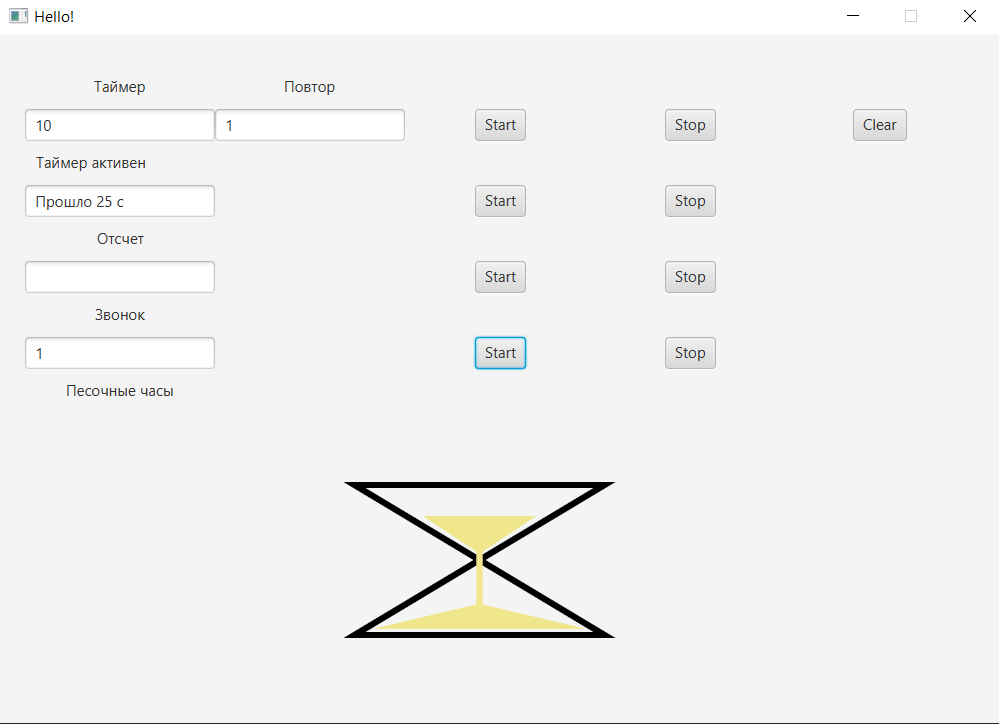
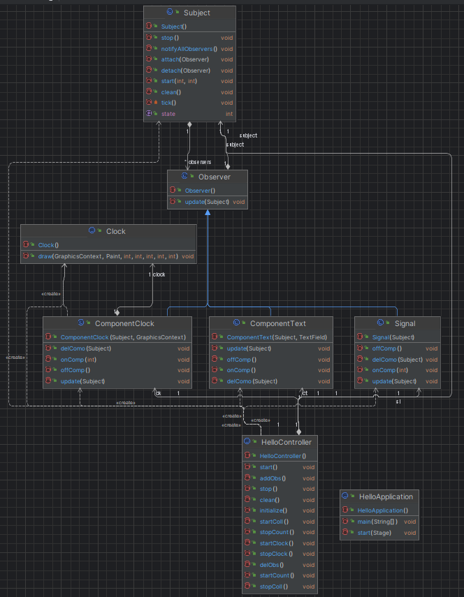

# Lab3 Observer
**Описание:** В этой лабораторной я создал приложение с использование паттерна OBserver. 
Паттрен observer, позволяет создать связь в приложении один ко многим, тем самым уменьшая связанность внутри кода программы.  
Сама программа представляет из себя несколько полей для воода и кнопки для начала отсчета различных событий. 
Для использования данного приложения вам необходимо:
* **Технологический стек**: Java. Данное ПО предназначено как автономное;
* **Статус**: v1.0.1;

**Скриншот рабочего окна приложения:**

## Архитектура
**Скриншот диаграммы классов:**

## Зависимости
Язык программироваия **Java**, комплект разработчика приложений **JDK 17**, а также инструментарий GUI **JavaFX**.
## Конфигурация
Для данного ПО не требуется специальная настройка
## Применение
Для использования данной программы вам необходимо:
- Ввести период и длительность основного таймера
- Можно включить счетчик прошедшего времени основного таймера
- Запустить звуковое оповещение, которое будет проигрываться каждый период основного таймера
- А также включить песочные часы которые будут работать по периоду основного таймера
